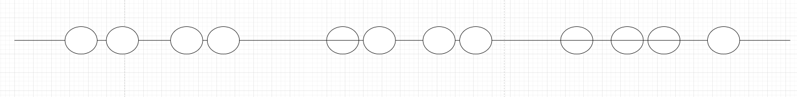
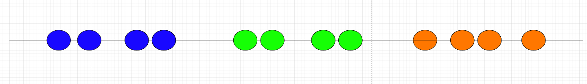
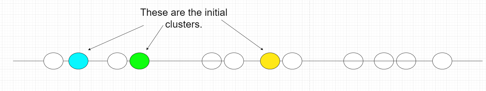
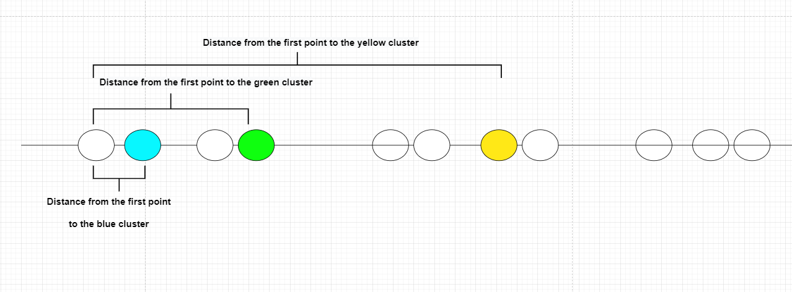
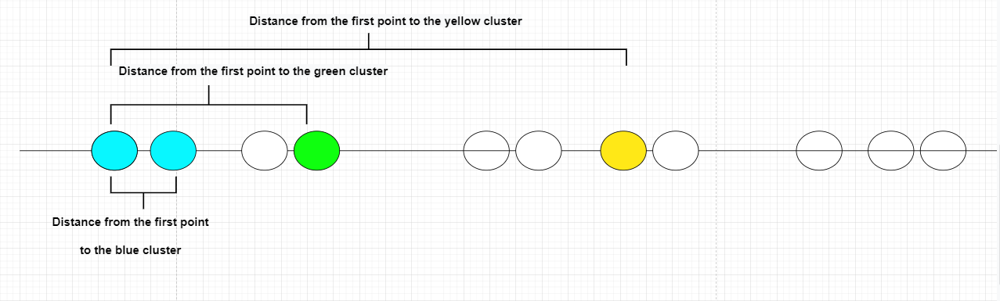
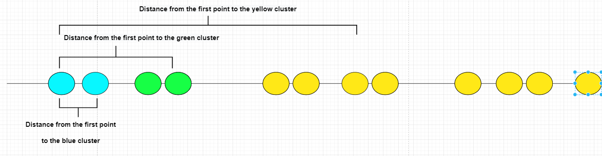
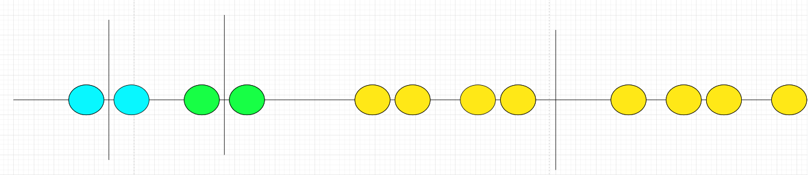
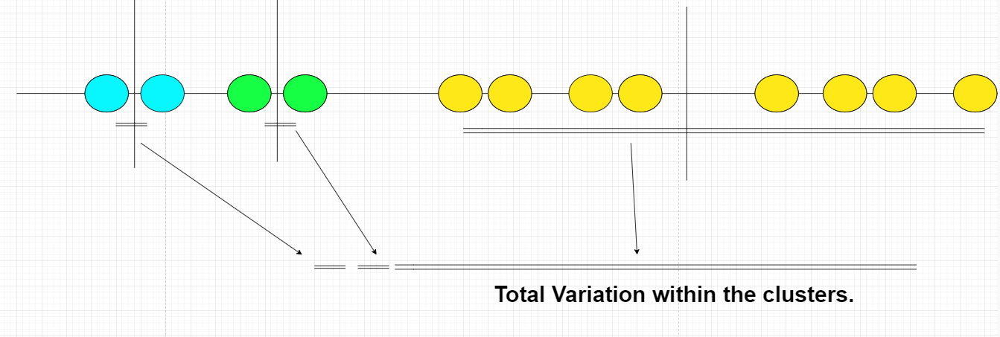
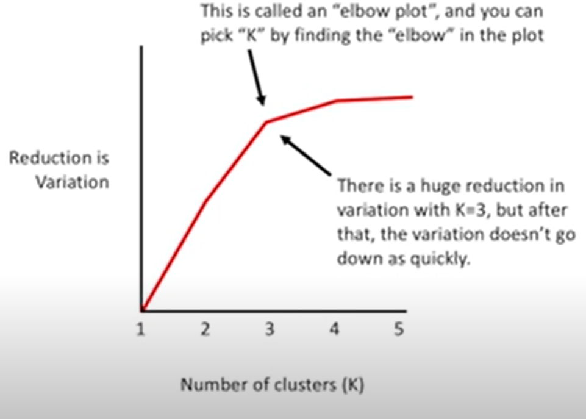

__K-means_Algorithm__Python__Hadoop

To start with, we will explain the algorithm k-means. we will imagine taht we have some data. We will bearing in mind that we need 3 clusters. 

So, in this case we observe that the data make 3 obvious clusters. 

However, let's see if we can get a computer to identify the same 3 clusters. For this purpose, we will use K-Means Clustering. 

Steps of the algorithm 

__Step 1__: Select the number of clusters you want to identify in your data. TThis is the "K" in "K-means" clustering. 

In this case we selected K = 3. Note : There is a fancier way to select a value for K, but we will talk about that later. 

__Step 2__: Randomly select 3 distinct data points. 

__Step 3__: Measure the distance between the 1st point and the three initial clusters. 

__Step4__: Assign the first point to the nearest cluster. In this case, the nearest is the blue cluster. With same logic we assign the following nodes to clusters. 

the final result after all assignments is : 

__Step 5__: Calculate the mean of each cluster. 

Then we repeat what we just did (measure and cluster) using the mean values. Since clustering did not change at all during the last iteration, we are done! 

At this point, it is importsnt to point out that we can assess rhe quality of the clustering by __adding__ up the __variation__ within each cluster. Since, K-means clustering can't see the best clustering, it's only option is to kepp truck of these clusters, and their total variance, and do the whole thing over again with diffrent starting points. 

__How do you figure out what value to use for __K__?

* One way via trials diffrent values to __K__ and calculate total variation. The winner will be the number of __K__ with the decreased total variance.

Via trials, we will observe that the total variation within each cluster is less than whan K = X. Each time we add a new cluster, the total variation within each cluster is smaller than before. And when there is only one point per cluster, the variation = 0. However, if we plot the reduction in variance per value for K...  

__Note__ :  What if our data isn't plotted on a number line? 

-> Just, like before, you pick three random points
and we use euclidean distance.  Then just like before, we assign to the nearest cluster. And just like before we then calculate the center of each cluster and recluster...  