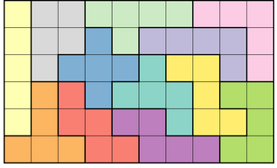

## Polyomino

A python script able to fix graph and count all possible combinations of polyominos.



Running the script you must include the number of squares, for example:

```
python count_fixed_polyominoes.py -p 4
```

The script will print the solution in this form: 
```
{(-2, 1): [(-1, 1)],
 (-1, 1): [(0, 1), (-1, 2), (-2, 1)],
 (-1, 2): [(0, 2), (-1, 1)],
 (0, 0): [(1, 0), (0, 1)],
 (0, 1): [(1, 1), (0, 2), (-1, 1), (0, 0)],
 (0, 2): [(1, 2), (0, 3), (-1, 2), (0, 1)],
 (0, 3): [(0, 2)],
 (1, 0): [(2, 0), (1, 1), (0, 0)],
 (1, 1): [(2, 1), (1, 2), (0, 1), (1, 0)],
 (1, 2): [(0, 2), (1, 1)],
 (2, 0): [(3, 0), (2, 1), (1, 0)],
 (2, 1): [(1, 1), (2, 0)],
 (3, 0): [(2, 0)]}
19
```